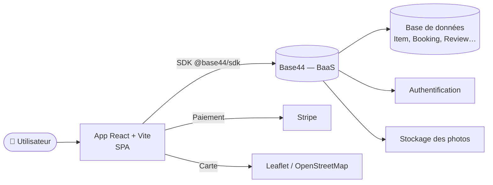

# Nirent — Location d'objets entre particuliers

**Nirent** est une marketplace web qui permet aux particuliers de **louer et de mettre en location des objets du quotidien** (outils, matériel de camping, équipement sportif, électronique, mobilier, véhicules…). La plateforme gère l'intégralité du parcours : publication d'une annonce avec géolocalisation, recherche par catégorie ou sur carte, réservation avec calcul automatique du prix et de la caution, échange sécurisé par codes PIN (remise et retour), messagerie entre utilisateurs, système d'avis, favoris, notifications, paiement en ligne et un panneau d'administration. L'objectif est de favoriser une **consommation collaborative** en rendant la location entre voisins simple et fiable.

> 🎓 Projet réalisé dans le cadre du cursus ingénieur de l'**ECE Paris** (ING4 — PFE/PPE). L'application a été conçue sur la plateforme **Base44** ; ce dépôt contient le code source front-end exporté.
>
> 🔗 Dépôt : https://github.com/Ismail-cherchar/Nirent

---

## 📑 Sommaire

- [Stack technique](#-stack-technique)
- [Architecture](#-architecture)
- [Prérequis](#-prérequis)
- [Installation et lancement](#-installation-et-lancement)
- [Variables d'environnement](#-variables-denvironnement)
- [Structure du projet](#-structure-du-projet)
- [Modèle de données](#-modèle-de-données)
- [Fonctionnalités principales](#-fonctionnalités-principales)
- [Documentation associée](#-documentation-associée)
- [Équipe](#-équipe)
- [Licence](#-licence)

---

## 🧱 Stack technique

| Domaine | Technologies |
|---|---|
| **Front-end** | React 18, React Router DOM 6, Vite 6 |
| **UI / Styles** | Tailwind CSS 3, shadcn/ui (Radix UI), lucide-react, Framer Motion |
| **Données / état** | TanStack React Query, Zod (validation), React Hook Form |
| **Back-end (BaaS)** | Base44 SDK (`@base44/sdk`) — authentification, base de données, fonctions |
| **Cartographie** | React Leaflet (OpenStreetMap) |
| **Paiement** | Stripe (`@stripe/react-stripe-js`) |
| **Divers** | Recharts (graphiques), jsPDF / html2canvas (export), date-fns / moment |
| **Qualité** | ESLint 9, TypeScript (vérification de types via `jsconfig`) |

---

## 🏗️ Architecture

Nirent est une **application web monopage (SPA)** React qui s'appuie sur un **back-end managé (BaaS)** Base44. Le client React communique avec Base44 via le SDK officiel (`src/api/base44Client.js`) pour l'authentification, l'accès aux données (entités) et le stockage des photos. Les paiements sont délégués à **Stripe** et la cartographie à **Leaflet / OpenStreetMap**.



- **Couche présentation** : pages (`src/pages/`) + composants (`src/components/`), routage côté client (`react-router-dom`).
- **Couche état/données** : React Query gère le cache et la synchronisation avec le back-end ; Zod valide les formulaires.
- **Couche back-end** : Base44 expose les entités (voir [Modèle de données](#-modèle-de-données)) et l'authentification, consommées via le SDK.

> 📄 Pour le détail complet (choix technologiques justifiés, tolérance aux pannes, évolutivité…), voir le **document d'architecture technique** dans le dossier projet.

---

## ✅ Prérequis

- **Node.js ≥ 18** (recommandé : 20 LTS) — requis par Vite 6
- **npm ≥ 9** (fourni avec Node.js)
- Un **compte / application Base44** pour disposer des identifiants back-end (voir [Variables d'environnement](#-variables-denvironnement))

Vérifier les versions installées :

```bash
node --version
npm --version
```

---

## 🚀 Installation et lancement

```bash
# 1. Cloner le dépôt
git clone https://github.com/Ismail-cherchar/Nirent.git
cd Nirent

# 2. Installer les dépendances
npm install

# 3. Configurer les variables d'environnement
cp .env.example .env.local
#   puis éditer .env.local avec vos identifiants Base44

# 4. Lancer le serveur de développement
npm run dev
```

L'application est ensuite accessible sur **http://localhost:5173**.

### Autres commandes

| Commande | Description |
|---|---|
| `npm run dev` | Démarre le serveur de développement (hot reload) |
| `npm run build` | Génère la version de production dans `dist/` |
| `npm run preview` | Sert localement le build de production |
| `npm run lint` | Analyse le code avec ESLint |
| `npm run lint:fix` | Corrige automatiquement les erreurs ESLint |
| `npm run typecheck` | Vérifie les types (TypeScript) |

---

## 🔐 Variables d'environnement

Les variables sont chargées par Vite depuis un fichier `.env.local` (non versionné). Un modèle est fourni dans **`.env.example`** :

| Variable | Obligatoire | Description |
|---|:---:|---|
| `VITE_BASE44_APP_ID` | ✅ | Identifiant de l'application Base44 |
| `VITE_BASE44_APP_BASE_URL` | ✅ | URL de base du back-end Base44 |
| `VITE_BASE44_FUNCTIONS_VERSION` | ⬜ | Version des fonctions Base44 (optionnel) |

> ⚠️ Ne **jamais** committer le fichier `.env.local` : il est déjà exclu via `.gitignore`.

---

## 📂 Structure du projet

```
Nirent/
├── entities/                 # Schémas JSON des entités (modèle de données Base44)
│   ├── Item                  #   Objet mis en location
│   ├── Booking               #   Réservation
│   ├── Favorite              #   Favori
│   ├── Review                #   Avis / notation
│   ├── Message               #   Message (messagerie)
│   ├── Notification          #   Notification
│   └── Report                #   Signalement / litige
├── src/
│   ├── api/                  # Client Base44 (base44Client.js)
│   ├── components/
│   │   ├── home/             #   Composants de la page d'accueil
│   │   ├── items/            #   Composants liés aux objets
│   │   ├── layout/           #   Composants de mise en page
│   │   ├── shared/           #   Composants partagés
│   │   └── ui/               #   Bibliothèque shadcn/ui (Radix)
│   ├── hooks/                # Hooks React personnalisés
│   ├── lib/                  # AuthContext, React Query, app-params, utils
│   ├── pages/                # 16 pages (Home, Search, MapView, AddItem, …)
│   ├── utils/                # Fonctions utilitaires
│   ├── App.jsx               # Composant racine + routage
│   ├── Layout.jsx            # Mise en page globale (navigation)
│   └── pages.config.js       # Configuration des routes
├── .env.example              # Modèle de variables d'environnement
├── components.json           # Configuration shadcn/ui
├── tailwind.config.js        # Configuration Tailwind
├── vite.config.js            # Configuration Vite
└── package.json              # Dépendances et scripts
```

---

## 🧩 Modèle de données

| Entité | Rôle |
|---|---|
| **Item** | Objet à louer : titre, description, catégorie, prix/jour, caution, photos, localisation (lat/lng), disponibilité, statut, mode de remise |
| **Booking** | Réservation : dates, prix total, caution, statut (en attente → acceptée → active → terminée), statut de paiement, codes PIN de remise et de retour |
| **Favorite** | Objet mis en favori par un utilisateur |
| **Review** | Avis 1–5 ★ entre locataire et propriétaire, lié à une réservation |
| **Message** | Message de la messagerie interne, regroupé par conversation |
| **Notification** | Notification utilisateur (réservation, message, avis, échange…) |
| **Report** | Signalement / litige (dommage, retard, fraude…) avec photos |

---

## ✨ Fonctionnalités principales

- 🔎 **Recherche et découverte** : par catégorie, mots-clés et vue **carte interactive** (Leaflet)
- 📦 **Gestion d'annonces** : publication d'objets avec photos, prix, caution et disponibilités
- 📅 **Réservation** : calcul automatique du prix et de la caution, workflow d'acceptation
- 🔐 **Échange sécurisé** : codes PIN de **remise** et de **retour** entre les deux parties
- 💳 **Paiement** : intégration Stripe
- 💬 **Messagerie** entre utilisateurs
- ⭐ **Avis & réputation** : notation croisée locataire / propriétaire
- ❤️ **Favoris** et 🔔 **notifications**
- 🛠️ **Panneau d'administration** : modération et gestion des signalements

---

## 📚 Documentation associée

Ce README est la **porte d'entrée** du dépôt. Pour aller plus loin, se référer aux autres livrables du projet :

- **Document d'architecture technique** — choix technologiques détaillés et justifiés, sécurité, évolutivité.
- **Document de prise en main** — guide utilisateur illustré (captures d'écran, cas d'usage pas à pas).
- **Cahier des charges (CDC)** — besoins, périmètre et contraintes du projet.

---

## 👥 Équipe

Projet collectif ECE — ING4 :

- **Ismael Cherchar**
- **Sacha**
- **Adam Bouchiba**
- **Lorenzo Preciozo**

---

## 📄 Licence

Projet académique — diffusion soumise à l'autorisation des auteurs. Voir le fichier `LICENSE` le cas échéant.
