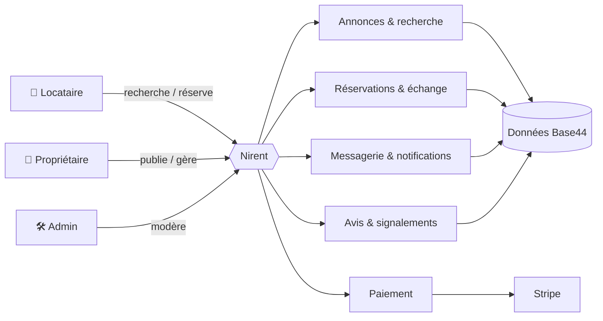
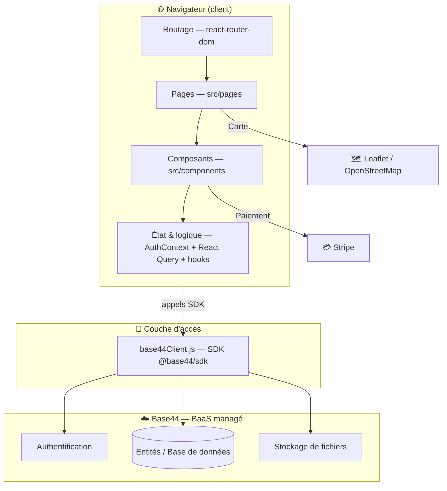
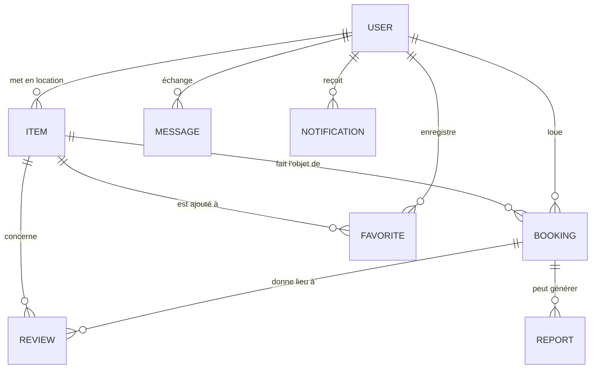
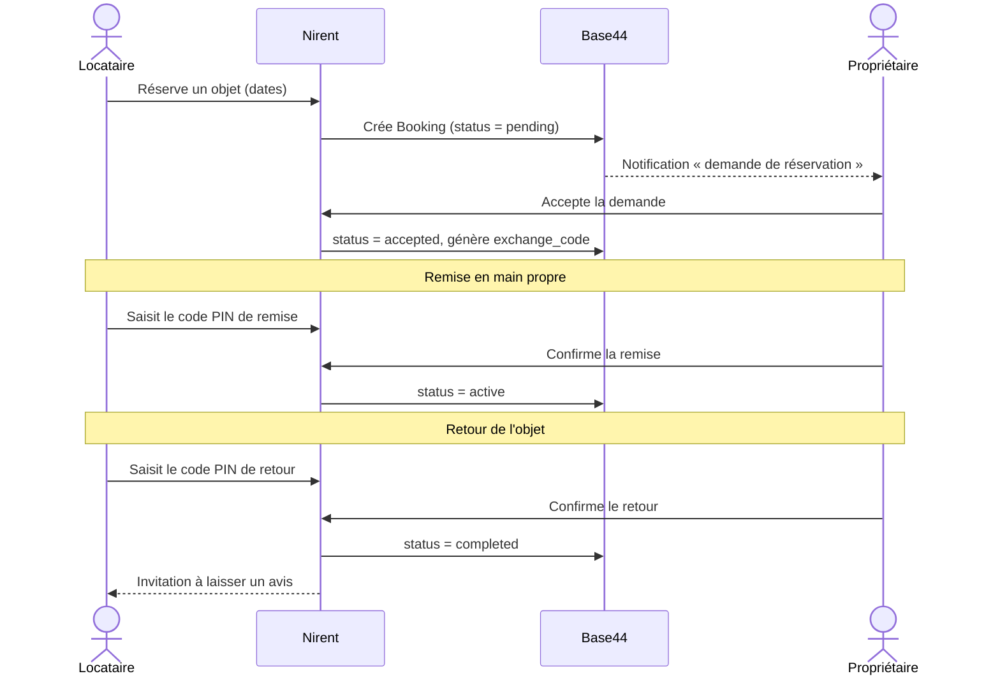

# Document d'architecture technique — Nirent

> Projet **Nirent** — marketplace de location d'objets entre particuliers.
> ECE Paris — ING4 (PFE/PPE). Document de référence pour la conception, la maintenance et la reprise du projet.
>
> 📄 Voir aussi : [README](../README.md) · [Document de prise en main](PRISE_EN_MAIN.md)

---

## 1. Introduction

Ce document décrit l'**architecture technique** de Nirent : la structure du code, les choix technologiques retenus et la manière dont les différents composants (client, back-end, services tiers) interagissent. Il a pour but de garantir la **cohérence**, la **maintenabilité** et la **pérennité** de la solution, et de permettre à toute personne (membre de l'équipe, coach, ou repreneur futur) de comprendre et faire évoluer le projet.

Nirent a été développé sur la plateforme **Base44** (Backend-as-a-Service) ; ce dépôt contient le **code source front-end** exporté, ainsi que les schémas des entités de données.

---

## 2. Description du système

### 2.1 Objectif

Permettre à des particuliers de **louer** et de **mettre en location** des objets du quotidien (outils, camping, sport, électronique, mobilier, véhicules…), en sécurisant l'ensemble du parcours : annonce, réservation, paiement, remise, retour et évaluation.

### 2.2 Périmètre fonctionnel

| Domaine | Fonctions couvertes |
|---|---|
| Annonces | Création, édition, mise en pause, suppression d'objets avec photos et géolocalisation |
| Découverte | Recherche par catégorie / mots-clés, vue carte interactive, favoris |
| Réservation | Demande, acceptation/refus, calcul prix + caution, suivi de statut |
| Échange | Codes PIN de remise et de retour, confirmation par les deux parties |
| Paiement | Paiement en ligne (Stripe) et gestion de la caution |
| Communication | Messagerie entre utilisateurs, notifications |
| Confiance | Avis croisés locataire/propriétaire, signalements/litiges |
| Administration | Modération, traitement des signalements |

### 2.3 Exigences non fonctionnelles

- **Expérience mobile-first** : interface pensée en priorité pour le smartphone (navigation par barre inférieure).
- **Réactivité** : SPA sans rechargement de page, mise en cache des données côté client (React Query).
- **Sécurité** : authentification déléguée à Base44, échanges sécurisés par codes PIN, variables sensibles hors dépôt.
- **Maintenabilité** : code modulaire (composants réutilisables, pages auto-enregistrées).

---

## 3. Architecture fonctionnelle

Les grandes fonctions du système et leurs interactions :

Le **cycle de vie d'une location** (réservation → remise → retour) repose sur des codes PIN confirmés des deux côtés — voir le diagramme de séquence en [annexe A.2](#a2-séquence--cycle-de-vie-dune-location).

---

## 4. Architecture matérielle / infrastructure

Nirent est une application **web cloud** : il n'y a pas de matériel spécifique (capteurs, serveurs auto-hébergés) à gérer.

| Élément | Description | Justification |
|---|---|---|
| **Client** | Navigateur web moderne (mobile ou desktop) exécutant la SPA | Aucune installation pour l'utilisateur ; portée maximale |
| **Hébergement front-end** | Fichiers statiques générés par Vite (`dist/`), servis via la plateforme Base44 | Build optimisé, distribution simple |
| **Back-end** | Infrastructure **managée Base44** (serveurs, base de données, authentification, stockage de fichiers) | Pas d'infrastructure à administrer → l'équipe se concentre sur le produit dans le temps imparti du projet |
| **Réseau** | Communications **HTTPS** entre le client, Base44 et les services tiers | Chiffrement des échanges |
| **Services tiers** | Stripe (paiement), OpenStreetMap via Leaflet (cartographie) | Solutions éprouvées, conformes aux standards |

> Le choix d'un **BaaS (Base44)** plutôt qu'un back-end auto-hébergé a été dicté par les contraintes de temps et de ressources d'un projet étudiant : il fournit immédiatement base de données, authentification, hébergement et stockage, sans administration système.

---

## 5. Architecture logicielle

### 5.1 Style d'architecture

Application **monopage (SPA)** React à architecture **par composants**, suivant un découpage en couches :

### 5.2 Organisation du code

| Dossier | Rôle |
|---|---|
| `src/pages/` | Les 16 écrans de l'application (auto-enregistrés dans `pages.config.js`) |
| `src/components/` | Composants réutilisables (`ui/` = shadcn/ui, `home/`, `items/`, `layout/`, `shared/`) |
| `src/lib/` | Logique transverse : `AuthContext.jsx` (authentification), `query-client.js` (React Query), `app-params.js` (paramètres d'app), `utils.js` |
| `src/api/` | `base44Client.js` : initialisation du client SDK Base44 |
| `src/hooks/` | Hooks React personnalisés (`use-mobile`) |
| `entities/` | Schémas JSON des entités (modèle de données) |

### 5.3 Frameworks et bibliothèques clés

| Besoin | Choix | Pourquoi |
|---|---|---|
| Rendu UI | **React 18** | Écosystème mature, composants réutilisables |
| Build / dev | **Vite 6** | Démarrage et HMR très rapides |
| Styles | **Tailwind CSS 3** + **shadcn/ui** (Radix) | Cohérence visuelle, composants accessibles prêts à l'emploi |
| Données serveur | **TanStack React Query** | Cache, synchronisation et gestion d'état serveur simplifiés |
| Validation | **Zod** + **React Hook Form** | Formulaires fiables et typés |
| Routage | **react-router-dom 6** | Standard du routage SPA |
| Cartographie | **React Leaflet** | Cartes open-source (OpenStreetMap), sans clé propriétaire |
| Paiement | **Stripe** | Référence du paiement en ligne sécurisé |

### 5.4 Modèles de conception (design patterns)

- **Composants + composition** : UI découpée en composants réutilisables.
- **Context Provider** (`AuthProvider`/`useAuth`) : état d'authentification global, exposé via un hook dédié.
- **Provider de cache** (`QueryClientProvider`) : gestion centralisée des requêtes (cache, `retry: 1`, pas de refetch au focus).
- **Configuration par convention** : les pages sont **auto-enregistrées** à partir des fichiers de `src/pages/` (voir `pages.config.js`), ce qui réduit le câblage manuel des routes.
- **Layout enveloppant** : `Layout.jsx` encadre toutes les pages (barre de navigation, badges de messages/notifications non lus).

---

## 6. Modèle de données

Le modèle s'appuie sur **7 entités** Base44, reliées entre elles par des références (email de l'utilisateur, identifiant d'objet). L'utilisateur (`User`) est l'entité native gérée par Base44.

| Entité | Champs clés | Rôle |
|---|---|---|
| **Item** | `title`, `category`, `price_per_day`, `deposit_amount`, `photos`, `latitude`/`longitude`, `status`, `delivery_options` | Objet mis en location |
| **Booking** | `item_id`, `renter_email`, `owner_email`, `start_date`/`end_date`, `total_price`, `status`, `payment_status`, `exchange_code`, `return_code` | Réservation et son cycle de vie |
| **Favorite** | `user_email`, `item_id` | Mise en favori |
| **Review** | `booking_id`, `rating` (1–5), `type` (renter↔owner) | Avis croisé |
| **Message** | `conversation_id`, `sender_email`, `receiver_email`, `text`, `read` | Messagerie |
| **Notification** | `user_email`, `type`, `read`, `link` | Notification |
| **Report** | `booking_id`, `type` (damage/late/fraud…), `status` | Signalement / litige |

> ⚠️ Base44 étant un BaaS orienté documents, l'intégrité référentielle (clés étrangères) n'est pas imposée par un SGBD relationnel : les relations sont **logiques** (par `email` / `item_id`) et garanties par la logique applicative.

---

## 7. Interfaces

### 7.1 Interface avec le back-end (SDK Base44)

L'accès aux données et à l'authentification passe **exclusivement** par le SDK `@base44/sdk`, initialisé dans `src/api/base44Client.js` :

- **Données** : `base44.entities.<Entité>.filter(...)`, `.create(...)`, `.update(...)`, `.delete(...)`
  *Exemple* : `base44.entities.Message.filter({ receiver_email: user.email, read: false })`
- **Authentification** : `base44.auth.me()`, `base44.auth.isAuthenticated()`, `base44.auth.redirectToLogin(...)`, `base44.auth.logout(...)`

### 7.2 Interfaces avec les services tiers

- **Stripe** : paiement et caution (`@stripe/react-stripe-js`).
- **Leaflet / OpenStreetMap** : affichage cartographique des objets (`MapView`).

### 7.3 Interface utilisateur

- **SPA mobile-first** : barre de navigation inférieure (Accueil, Recherche, Ajouter, Messages, Profil), masquée sur certains écrans plein-écran (Chat, Carte, Échange…).
- Identité visuelle : couleur de marque `#f9b816`.

---

## 8. Gestion des erreurs et tolérance aux pannes

| Mécanisme | Mise en œuvre |
|---|---|
| **Erreurs d'authentification** | `AuthContext` distingue `auth_required`, `user_not_registered`, token expiré (401/403) et affiche l'écran adapté / redirige vers le login |
| **États de chargement** | Indicateurs de chargement pendant la vérification des paramètres publics et de l'auth (`isLoadingAuth`, `isLoadingPublicSettings`) |
| **Reprise sur requête échouée** | React Query : `retry: 1` (une nouvelle tentative automatique) |
| **Route inconnue** | Page `PageNotFound` (catch-all `*`) |
| **Persistance & sauvegardes** | Assurées au niveau de la plateforme **managée Base44** (base de données, stockage) |
| **Confidentialité** | Variables d'environnement (identifiants Base44) **hors dépôt** via `.gitignore` |

> Les garanties précises de disponibilité et de sauvegarde (RPO/RTO) dépendent de l'offre Base44 utilisée et relèvent de la plateforme.

---

## 9. Évolutivité et extensibilité

- **Ajouter un écran** : créer un fichier dans `src/pages/` → la page est automatiquement enregistrée (convention `pages.config.js`).
- **Ajouter une donnée** : définir une nouvelle entité (schéma JSON) et la consommer via le SDK.
- **Composants réutilisables** : la bibliothèque `components/ui` (shadcn/ui) facilite l'ajout d'écrans cohérents.
- **Pistes d'évolution** : application mobile native (le design mobile-first s'y prête), paiement multi-devises, recommandations personnalisées, internationalisation (i18n), tests automatisés (unitaires/E2E).

---

## 10. Normes et conventions

- **Alias d'import** `@/` → `src/` (configuré dans `jsconfig.json` et le plugin Vite).
- **Lint** : ESLint 9 (`npm run lint`) ; règles React + détection des imports inutilisés.
- **Vérification de types** : `checkJs` activé via `jsconfig.json` (`npm run typecheck`).
- **Conventions de nommage** : pages en PascalCase, composants réutilisables regroupés par domaine.
- **Langue** : interface et libellés en **français**.
- **Versionnage** : Git, branche stable `main`, messages de commit explicites en français (préfixes `feat` / `chore` / `docs`).

---

## 11. Conclusion

Nirent repose sur une architecture **SPA React + BaaS Base44** claire et modulaire : un front-end structuré en couches (pages, composants, état, accès SDK) et un back-end managé qui prend en charge données, authentification et stockage. Ce choix a permis de livrer une solution **complète et fonctionnelle** (annonces, réservation, échange sécurisé, paiement, messagerie, avis) dans le cadre d'un projet étudiant, tout en restant **maintenable** et **extensible**.

**Perspectives** : déclinaison mobile native, tests automatisés, internationalisation et enrichissement des fonctions de confiance (vérification d'identité, assurance).

---

## Annexes

### A.1 Récapitulatif des diagrammes

- Architecture fonctionnelle — §3
- Architecture logicielle en couches — §5.1
- Modèle de données (entités/relations) — §6
- Séquence du cycle de location — §A.2

### A.2 Séquence — cycle de vie d'une location

### A.3 Ressources externes

- React — https://react.dev
- Vite — https://vite.dev
- Tailwind CSS — https://tailwindcss.com
- shadcn/ui — https://ui.shadcn.com
- TanStack React Query — https://tanstack.com/query
- React Leaflet — https://react-leaflet.js.org
- Stripe — https://stripe.com/docs
- Base44 — https://base44.com
