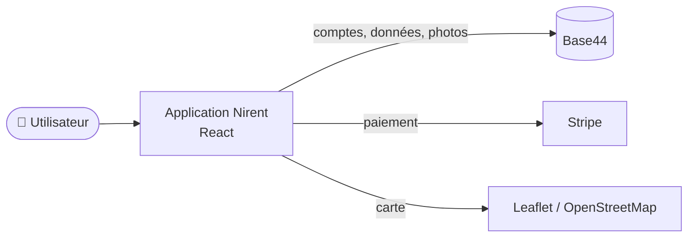

# Document de prise en main — Nirent

> 👋 Bienvenue ! Ce guide est la **première porte d'entrée** vers le projet **Nirent**. Il s'adresse à toute personne qui découvre le projet (nouveau membre, repreneur, partenaire) et explique **ce que fait l'application**, **comment l'installer** et **comment la faire évoluer** — sans présupposer de connaissances pointues.
>
> 📄 Pour les détails techniques : voir le [README](../README.md) et le [Document d'architecture technique](ARCHITECTURE.md).

---

## 1. Introduction

**Nirent** est une marketplace web de **location d'objets entre particuliers**. L'idée : plutôt que d'acheter une perceuse, une tente ou un vidéoprojecteur qu'on utilisera deux fois, on les **loue à un voisin** — et on peut soi-même rentabiliser ses propres objets en les mettant en location.

**En un coup d'œil, l'application permet de :**

- 📦 publier un objet à louer (photos, prix/jour, caution, localisation) ;
- 🔎 rechercher un objet par catégorie ou sur une **carte** ;
- 📅 réserver, payer en ligne et suivre l'état de sa location ;
- 🔐 sécuriser la remise et le retour grâce à des **codes PIN** ;
- 💬 discuter avec l'autre partie et recevoir des **notifications** ;
- ⭐ laisser un **avis** après la location.

---

## 2. Vue d'ensemble du projet

Nirent est une **application web monopage** (elle s'utilise comme une app mobile, directement dans le navigateur). Elle est construite avec **React** et s'appuie sur **Base44** pour toute la partie back-end (comptes utilisateurs, base de données, stockage des photos). Le paiement passe par **Stripe** et la carte par **Leaflet / OpenStreetMap**.



> 📸 *Capture à insérer : page d'accueil de Nirent avec la liste des objets.*

Les **briques principales** :

| Brique | À quoi ça sert |
|---|---|
| **Pages** (`src/pages/`) | Les 16 écrans (accueil, recherche, fiche objet, réservations, messagerie…) |
| **Composants** (`src/components/`) | Les éléments d'interface réutilisables (boutons, cartes, formulaires…) |
| **Authentification** (`src/lib/AuthContext.jsx`) | Gère la connexion de l'utilisateur via Base44 |
| **Client Base44** (`src/api/base44Client.js`) | Le « pont » entre l'application et le back-end |
| **Entités** (`entities/`) | La description des données (objet, réservation, avis…) |

---

## 3. Installation de l'environnement

### Prérequis (outils à installer)

- **Node.js ≥ 18** (recommandé 20 LTS) → https://nodejs.org
- **Git** → https://git-scm.com
- Un éditeur de code, par ex. **VS Code** → https://code.visualstudio.com
- Les **identifiants Base44** du projet (App ID + URL du back-end)

### Étapes (pas à pas)

```bash
# 1. Récupérer le projet
git clone https://github.com/Ismail-cherchar/Nirent.git
cd Nirent

# 2. Installer les dépendances
npm install

# 3. Créer son fichier de configuration
cp .env.example .env.local
#    → ouvrir .env.local et renseigner VITE_BASE44_APP_ID et VITE_BASE44_APP_BASE_URL

# 4. Démarrer l'application
npm run dev
```

➡️ L'application s'ouvre sur **http://localhost:5173**.

> 💡 Si `npm run dev` ne s'ouvre pas tout seul, copiez l'adresse affichée dans le terminal et collez-la dans votre navigateur.

> 📸 *Capture à insérer : le terminal après `npm run dev` (URL locale visible).*

---

## 4. Structure du code source

```
Nirent/
├── entities/        → description des données (Item, Booking, Review…)
├── src/
│   ├── pages/       → les écrans de l'application
│   ├── components/  → les éléments d'interface réutilisables
│   ├── lib/         → authentification, configuration, utilitaires
│   ├── api/         → connexion au back-end Base44
│   └── hooks/       → fonctions React réutilisables
├── docs/            → cette documentation
├── .env.example     → modèle de configuration
└── README.md        → point d'entrée du dépôt
```

**Conventions utiles à connaître :**

- L'import `@/` correspond au dossier `src/` (ex. `@/components/...`).
- Pour **ajouter un écran**, il suffit de créer un fichier dans `src/pages/` : il est automatiquement pris en compte.
- Les **couleurs et styles** s'appuient sur Tailwind CSS ; la couleur de marque est le jaune `#f9b816`.

---

## 5. Fonctionnalités principales (cas d'usage)

### 👤 Côté locataire — louer un objet

1. **Rechercher** un objet (catégorie, mots-clés, ou via la **carte**).
2. Ouvrir la **fiche de l'objet**, choisir les **dates**, voir le prix et la caution.
3. **Réserver** : le propriétaire reçoit une demande.
4. Une fois acceptée et payée, récupérer l'objet et **valider la remise avec le code PIN**.
5. À la fin, **valider le retour avec le code PIN**, puis **laisser un avis**.

> 📸 *Capture à insérer : fiche d'un objet avec le sélecteur de dates.*

### 📦 Côté propriétaire — mettre un objet en location

1. Appuyer sur le bouton central **« Ajouter »**.
2. Renseigner **titre, description, catégorie, prix/jour, caution, photos, localisation**.
3. Publier : l'objet devient visible dans la recherche.
4. **Accepter / refuser** les demandes de réservation et suivre les échanges.

> 📸 *Capture à insérer : formulaire d'ajout d'un objet.*

### 🛠️ Côté administrateur

- Accès au **panneau d'administration** pour modérer et traiter les **signalements** (objets endommagés, retards, fraudes).

---

## 6. Bonnes pratiques de développement

- ✅ **Ne jamais committer** le fichier `.env.local` (il contient les identifiants) — il est déjà ignoré par Git.
- ✅ Lancer **`npm run lint`** avant de pousser pour garder un code propre.
- ✅ Faire des **commits explicites en français** (ex. « feat: ajout du filtre par catégorie »), jamais « update » ou « fix ».
- ✅ Réutiliser les composants existants de `components/ui` plutôt que d'en recréer.
- ⚠️ **Piège** : l'application a besoin des variables `VITE_BASE44_*` pour fonctionner. Sans elles, l'écran reste en chargement.

### 🧗 Difficultés rencontrées (et solutions)

Pour aider les repreneurs, voici les vrais points de blocage rencontrés :

| Difficulté | Solution apportée |
|---|---|
| Projet développé sur Base44 → **pas d'historique Git** | Migration du code vers un dépôt GitHub propre, avec un historique de commits structuré |
| Le **README généré par Base44** était générique (sans rapport avec le projet) | Réécriture complète d'un README conforme aux attendus |
| Le `.gitignore` excluait aussi **`.env.example`** (qui doit, lui, être versionné) | Ajout de l'exception `!.env.example` |
| Au `git push` : erreur **SSL « unable to get local issuer certificate »** (Windows) | Configuration `git config http.sslBackend schannel` (utilise le magasin de certificats Windows) |

---

## 7. Références utiles

- 📘 [README du projet](../README.md) — installation et commandes
- 🏗️ [Document d'architecture technique](ARCHITECTURE.md) — choix techniques détaillés
- 🔗 Dépôt GitHub — https://github.com/Ismail-cherchar/Nirent
- Documentations : [React](https://react.dev) · [Vite](https://vite.dev) · [Tailwind](https://tailwindcss.com) · [Base44](https://base44.com) · [Stripe](https://stripe.com/docs)

---

## 8. Contacts et support

Projet collectif ECE — ING4 : **Ismael Cherchar**, **Sacha**, **Adam Bouchiba**, **Lorenzo Preciozo**.

Pour toute question sur la reprise du projet, se rapprocher de l'équipe ou du coach référent.

---

## 9. Et maintenant ?

Nirent est une base **solide et fonctionnelle** : tout le cycle de location — de l'annonce à l'avis, en passant par l'échange sécurisé et le paiement — est en place. Il reste de belles pistes à explorer (application mobile, tests automatisés, vérification d'identité…). 🚀

**À vous de jouer — bonne reprise, et amusez-vous bien !**
